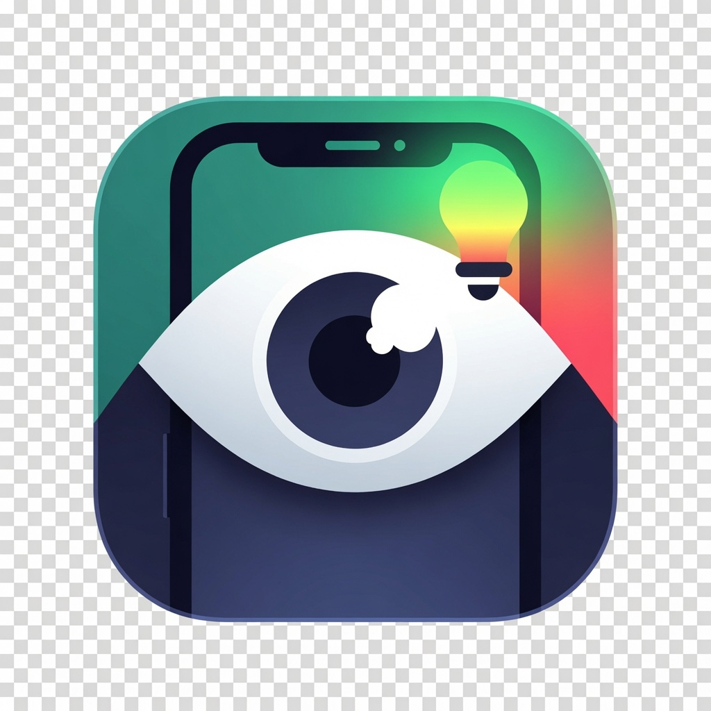

# Color Watch

Приложение на Flutter для Android, которое следит за цветовым индикатором через
камеру смартфона и поднимает тревогу при смене цвета — мелодией и уведомлением.
Дополнительно умеет транслировать видео и статус на второй телефон или в браузер
по локальной сети, **без интернета**.

[](https://github.com/keshtoim/ColorWatch/actions/workflows/build.yml)

Типичный сценарий: зелёная лампочка на оборудовании загорается красным — Color
Watch замечает это и сразу сигналит. Подходит для наблюдения за серверной
стойкой, котлом, 3D-принтером, зарядкой или любым прибором с цветовым
индикатором, пока вы заняты другими делами.

## Возможности

- 🎥 **Отслеживание смены цвета** в реальном времени. Анализируется центральная
  зона кадра, цвет переводится в HSV — это устойчивее к перепадам освещения.
- 🔔 **Звуковая и визуальная тревога** при изменении: мелодия звонка + системное
  уведомление.
- ♾️ **Режим 24/7** — фоновый foreground-сервис, наблюдение продолжается со
  свёрнутым приложением.
- 📡 **Трансляция на второй телефон** по локальной сети без интернета.
- 🪟 **Плавающее окно** на телефоне-зрителе — видео поверх других приложений.
- 💻 **Веб-зритель** — любой браузер на компьютере открывает страницу с видео и
  оповещениями, установка не требуется.

## Режимы

Один и тот же APK ставится на оба телефона, режим выбирается на старте:

| Режим | Что делает |
|-------|------------|
| **Камера** | Следит за цветом в центральной рамке, поднимает локальный HTTP-сервер и показывает адрес для подключения. |
| **Зритель** | Подключается к камере по адресу, показывает живое видео, опрашивает статус и сам сигналит при смене цвета. |

## Быстрый старт (схема hotspot)

Интернет не нужен ни одному устройству — связь идёт напрямую внутри локальной
сети телефона-камеры:

1. На телефоне-камере включите точку доступа (hotspot).
2. Второй телефон или компьютер подключите к этой точке доступа по Wi-Fi.
3. В приложении на камере выберите **Камера** — она покажет адрес вида
   `http://192.168.43.1:8080`.
4. На зрителе выберите **Зритель**, введите адрес и нажмите «Подключиться»
   (либо просто откройте адрес в браузере на компьютере).

> Если есть общий Wi-Fi роутер, можно подключить оба устройства к нему — адрес
> будет другим, он тоже отображается на экране камеры.

## Как это работает

- Камера стримит кадры, анализирует цвет центральной зоны (HSV) и параллельно
  кодирует уменьшенный кадр в JPEG в фоновом изоляте (`compute` + `package:image`).
- Локальный HTTP-сервер (`package:shelf`) раздаёт видео и статус другим
  устройствам (эндпоинты — в таблице ниже).
- Зритель показывает `/stream` через `Image.network` и раз в секунду опрашивает
  `/status`; при смене цвета проигрывает мелодию и шлёт уведомление.

| Эндпоинт | Назначение |
|----------|------------|
| `/` | Веб-страница зрителя для браузера |
| `/stream` | Видеопоток MJPEG (поток JPEG-кадров, ~5 fps) |
| `/status` | JSON с текущим цветом и временем последней смены |

Цвет классифицируется по оттенку (Hue): зелёный ≈ 90–160°, красный ≈ 0° и
345–360°. Пиксели с низкой насыщенностью или яркостью игнорируются, чтобы тусклый
или тёмный фон не давал ложных срабатываний. Пороги настраиваются в
[`lib/shared.dart`](lib/shared.dart) (метод `classify`).

## Веб-зритель (браузер)

Телефон-камера раздаёт готовую страницу зрителя — отдельная программа для
компьютера не нужна:

1. Подключите компьютер к точке доступа камеры по Wi-Fi.
2. Откройте в браузере адрес с экрана камеры (например `http://192.168.43.1:8080`).
3. Нажмите «Включить звук и уведомления» — браузеры блокируют звук и уведомления
   до первого действия пользователя.

После этого браузер показывает живое видео и при смене цвета пищит (Web Audio) и
шлёт уведомление. Работает в любой ОС без установки. Сама страница —
[`assets/viewer.html`](assets/viewer.html).

## Плавающее окно (зритель)

В режиме «Зритель» после подключения доступна кнопка «Плавающее окно» — она
выводит видеопоток поверх других приложений, чтобы видеть индикатор в углу
экрана, занимаясь другими делами.

- При первом запуске Android попросит разрешение «Поверх других приложений»
  (`SYSTEM_ALERT_WINDOW`) — его нужно выдать вручную.
- Окно перетаскивается пальцем, закрывается крестиком в углу.
- Overlay работает в отдельном Flutter-движке (ограничение платформы), поэтому
  он не делит состояние с основным экраном, а сам подключается к камере и тянет
  тот же MJPEG-поток. Адрес передаётся ему автоматически.

## Сборка APK

Сборка полностью автоматизирована через GitHub Actions — локальная установка
инструментов не нужна:

1. Запушьте изменения в ветку `main` или `master`.
2. Во вкладке **Actions** автоматически запустится workflow **Build APK**.
3. Откройте завершённый запуск → **Artifacts** → скачайте `color-watch-apk`.
4. Установите `app-release.apk` на оба телефона — режим выбирается в приложении.

Папка `android/` намеренно не хранится в репозитории: workflow генерирует её
заново через `flutter create` при каждой сборке. Это гарантирует, что версии
Gradle/AGP/Kotlin всегда совпадают, и устраняет частую причину сбоев сборки.
Кастомный манифест, иконка и фиксированные версии накладываются поверх
сгенерированной обвязки.

## Структура проекта

```text
lib/main.dart          # стартовый экран выбора режима
lib/camera_page.dart   # режим камеры: детект + HTTP-сервер + foreground-сервис
lib/viewer_page.dart   # режим зрителя: видео + опрос статуса + плавающее окно
lib/overlay_view.dart  # UI плавающего окна (отдельный Flutter-движок)
lib/shared.dart        # классификатор цвета, мелодия + уведомления
assets/viewer.html     # страница веб-зрителя для браузера
assets/alarm.mp3       # мелодия звонка
assets/icon.png        # иконка приложения (генерится в иконки при сборке)
overrides/AndroidManifest.xml   # разрешения + сервисы, накладывается в CI
.github/workflows/build.yml     # сборка APK
```

## Технологии

| Компонент | Назначение |
|-----------|------------|
| Flutter / Dart | Основной фреймворк и язык |
| `camera` | Доступ к камере и поток кадров |
| `image` | Кодирование кадров в JPEG |
| `shelf` | Локальный HTTP-сервер на камере |
| `http` | Запросы статуса со стороны зрителя |
| `flutter_local_notifications` | Системные уведомления |
| `audioplayers` | Воспроизведение мелодии |
| `flutter_foreground_task` | Фоновый сервис 24/7 |
| `flutter_overlay_window` | Плавающее окно поверх приложений |
| `network_info_plus` | Определение локального IP-адреса |
| `flutter_launcher_icons` | Генерация иконки приложения при сборке |

## Совместимость с Android

- **minSdk 21** — ставится на Android 5.0 и новее, включая Android 10.
- **targetSdk 34** — зафиксирован в workflow: приложение работает на Android 16,
  но не попадает под самые строгие runtime-ограничения Android 15+ для
  foreground-сервисов.
- **compileSdk** оставлен таким, как ставит Flutter (CameraX 1.5 требует 35+).
- Для Android 14+ тип foreground-сервиса `camera` объявлен в
  [`overrides/AndroidManifest.xml`](overrides/AndroidManifest.xml) — без этого
  сервис на новых Android не стартует.
- Уведомления запрашиваются в runtime (требуется для Android 13+).

Нагрузка распределяется удачно: телефон-камера на более старом Android (где
правила мягче) выполняет самую требовательную работу, а телефон-зритель на новом
Android использует только сеть и уведомления.

## Ограничения

- **Освещение** — главный источник ложных срабатываний. Пороги цветов почти
  всегда требуют подстройки под конкретную лампочку и условия.
- **Фоновая работа** ограничена системой Android и зависит от производителя:
  некоторые прошивки агрессивно завершают фоновые сервисы. Реалистичный режим
  24/7 — телефон на зарядке и на подставке.
- **MJPEG** — это поток картинок, а не полноценное видео реального времени.
- **Связь** требует общей локальной сети или точки доступа; совсем без сети
  устройства не найдут друг друга.
- **Позиционирование** — телефон-камеру нужно держать неподвижно, нацеленным на
  индикатор, желательно на подставке.

## История версий

| Версия | Что добавлено |
|--------|---------------|
| 1.0 | Отслеживание смены цвета через камеру + уведомление. Сборка APK через GitHub Actions. |
| 1.1 | Мелодия звонка при смене цвета. Режим работы 24/7 через foreground-сервис. |
| 1.2 | Трансляция видео и статуса на второй телефон. Режимы «Камера» и «Зритель». |
| 1.3 | Поддержка Android 10–16: фиксация targetSdk, явное объявление типа сервиса. |
| 1.4 | Вывод видео в плавающее окно поверх других приложений. |
| 1.5 | Веб-зритель для компьютера: страница с видео и оповещениями в браузере. |
